# エクスプローラービューとエディター

## ファイルをすばやく開く方法

VSCode では目的のファイルを開く方法として、複数の方法が用意されています。
状況に応じてすばやくファイルを開くことができると開発に集中できます。

### 方法 1 : エクスプローラービューから

エクスプローラービューのファイルツリーでファイルをクリックすると、そのファイルがエディターで開かれます。
ファイルをクリックすると、そのエディターのタブのファイル名は斜体で表示されます。
これは、一時的に開いているファイルで、別のファイルを開くとこのファイルは閉じられます。

<figure class="wide">
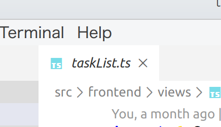
<figcaption>一時的に開いているファイルのタブ（ファイル名が斜体で表示）</figcaption>
</figure>

一時的に開かれているファイルを閉じないようにするには、:Cmd+S、/:Ctrl+S で保存するか、ファイルツリーのファイル名をダブルクリック、もしくはエディターのタブのファイル名をダブルクリックします。

### 方法 2 : ファイラーからドラッグドロップ

<figure class="wide">
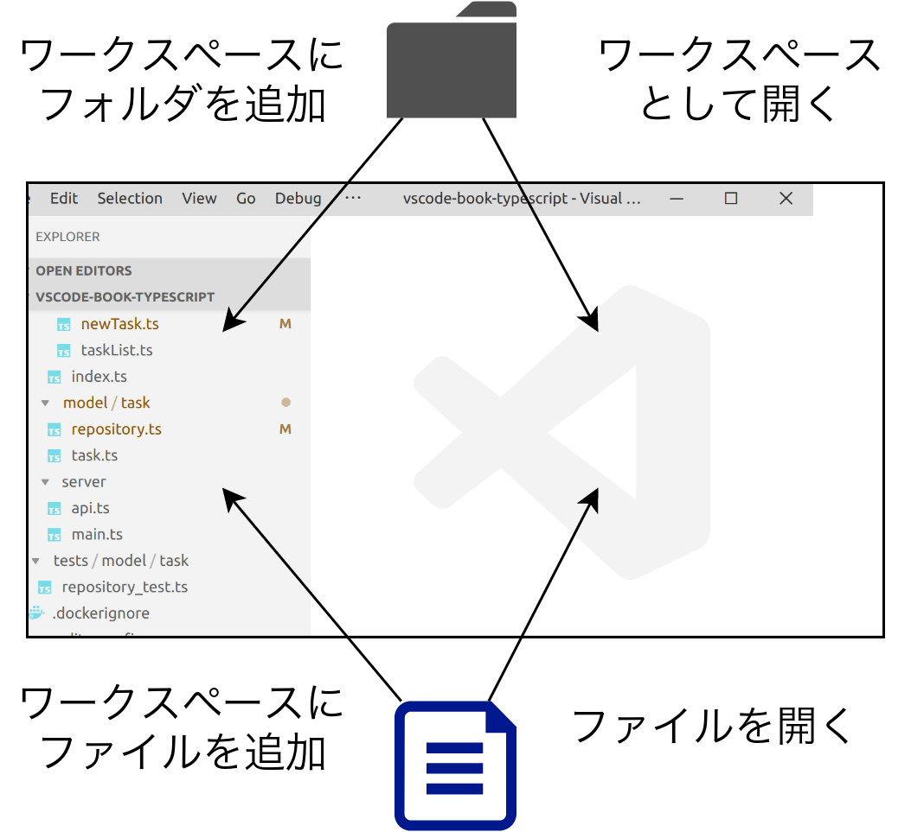
<figcaption>ドラッグドロップ</figcaption>
</figure>

macOS の Finder、Windows のエクスプローラー、Linux の Gnome3 Files から VSCode にファイルをドラッグドロップすることができます。
そして、ドロップ先によって機能が異なります。

エディターの中にファイルをドロップしたときには、そのファイルをエディターで開くことができます。
また、エディターの中にフォルダーをドロップした場合は、そのフォルダーをワークスペースとして開くことができます。
この時、現在開いているワークスペースは一度閉じられることに注意してください。

一方、ファイルやフォルダーをエクスプローラービューにドロップした時には、そのファイルやフォルダーがファイルツリーに追加されます。

また、ファイルやフォルダーをパネルのターミナルタブにドロップすると、ターミナルにフルパスが記入されます。

### 方法 3 : Go To File のあいまい検索を使う（Quick Open）

ワークスペースからあいまい検索でファイルを検索することができます。

<figure class="wide">
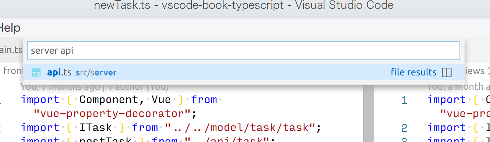
<figcaption>ファイルのあいまい検索（Quick Open）</figcaption>
</figure>

リストに表示されるファイルの右側にフォルダーのパスが表示されます。
ここにはディレクトリの名前を入れて検索することもできます。
ただし、<u>ファイル名の前にディレクトリ名を入れる必要がある</u>ことに注意してください。

- ファイルをあいまい検索する
  - コマンド: Go to file... (workbench.action.quickOpen)
  - ショートカット: Cmd+P, Ctrl+P, Ctrl+P

このあいまい検索ができる機能には「Quick Open」という名称です。
はじめに文字を入れることで機能を変えることができます。
文字と機能の対応は「?」をいれると確認できます。

### 方法 4: シンボルであいまい検索

TypeScript でのクラスや名前空間は VSCode 内ではシンボルとして扱われます。
これらのシンボルはキーボードショートカットかコマンド「Go To Symbol in Workspace...」を押すと、ワークスペース内のシンボルをあいまい検索し、シンボルが記述されたファイルを開くことができます。

<figure class="wide">
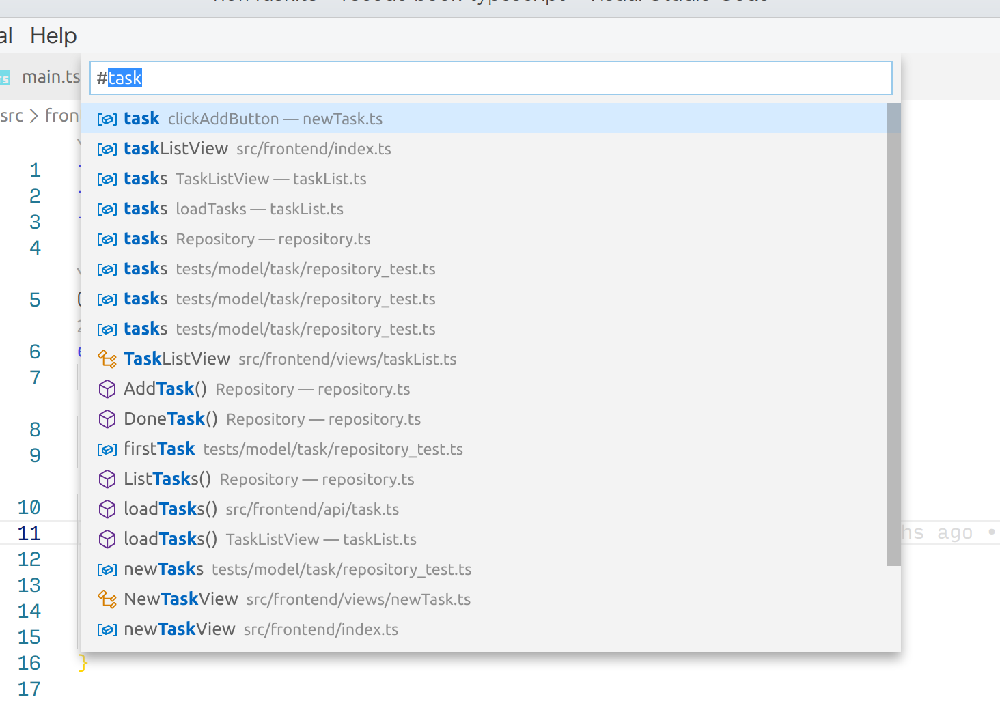
<figcaption>シンボルであいまい検索</figcaption>
</figure>

- シンボルを検索する
  - コマンド: Go to Symbol in Workspace... (workbench.action.showAllSymbols)
  - ショートカット: Cmd+T, Ctrl+T, Ctrl+T
- ファイル内のシンボルを検索する
  - コマンド: Go to Symbol in File... (workbench.action.gotoSymbol)
  - ショートカット: Cmd+Shift+O, Ctrl+Shift+O, Ctrl+Shift+O

また、Quick Open からは、ワークスペース内のシンボル検索は「#」、ファイル内のシンボル検索は「@」で呼び出すことができます。

### 方法 5 : code コマンド

VSCode をインストールすると code コマンドが使えますが、このコマンドでファイルを開くこともできます。
code コマンドの引数にファイルを指定すると、VSCode が起動していない場合、新しく起動してそのファイルを開きます。
既に VSCode が起動している場合は、その起動しているウィンドウの中に表示されます。
フォルダーを指定すると、新しいウィンドウでフォルダーが開くため注意が必要です。

ターミナルタブ内でも code コマンドを使うことができるため、ターミナルタブを使っているならばそのまま code コマンドを使ってファイルを開くことができます。

### 方法 6 : 定義や参照で開く

TypeScript では他のソースから引用したクラス名に対して、F12 キーやコマンド「Go To Definition」、もしくはクラス名の単語を Ctrl キーを押しながらクリックすると、定義先のファイルを開くことができます。
また、そのクラス名を右クリックして、「Go To Reference」を選ぶと、クリックした場所に定義を参照しているファイルが開かれます。

<figure class="wide">
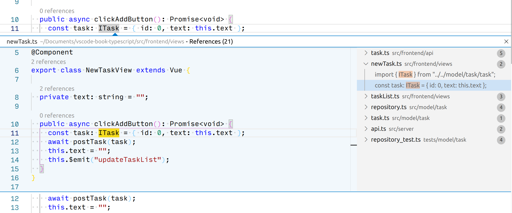
<figcaption>参照の検索</figcaption>
</figure>

このエディター内ウィンドウをダブルクリックするとそのファイルが開きます。

- 定義にジャンプ
  - コマンド: Go to Definition (editor.action.revealDefinition)
  - ショートカット: F12, F12, F12
- 参照を表示する
  - コマンド: Go to References (editor.action.findReferences)
  - ショートカット: 割当なし

### 方法 6 : エディタータブで開いているファイルを開く

エディタータブで既に開いているファイルをアクティブにしたい場合は、そのファイルのタブをクリックします。
このタブで開いているファイルの一覧はエクスプローラービューにもあるため、ここから見つけてクリックすることもできます。

<figure class="wide">
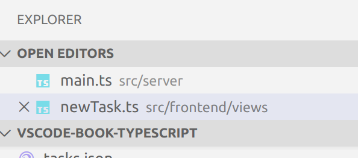
<figcaption>開いているファイル</figcaption>
</figure>

この一覧についてもあいまい検索を行うことができます。
Cmd+P, /Ctrl+P を押し`edt`と入力するとエディターで開いているファイルの一覧が検索できます。
コマンド「View: Show All Editors」でも行うことができるので、よく使われる方はこれをキーボードショートカットに登録すると良いでしょう。

- エディターで開いているファイルをあいまい検索する
  - コマンド: View: Show All Editors By Appearance (workbench.action.showAllEditors)
  - ショートカット: Alt+Cmd+Tab, Ctrl+K Ctrl+P, Ctrl+K Ctrl+P
- 現在のエディターグループで開いているファイルをあいまい検索する
  - コマンド: View: Show Editors in Active Editor By Most Recently Used (workbench.action.showEditorsInActiveGroup)
  - ショートカット: 割当なし

### 方法 7 : 階層リンク

エディターの上部には階層リンク（パンくずリスト）が表示されます。
階層リンクには、ディレクトリやファイルが表示されています。
ここをクリックすると、ディレクトリやこのファイルと兄弟関係にあるファイルを開くことができます。

<figure class="wide">
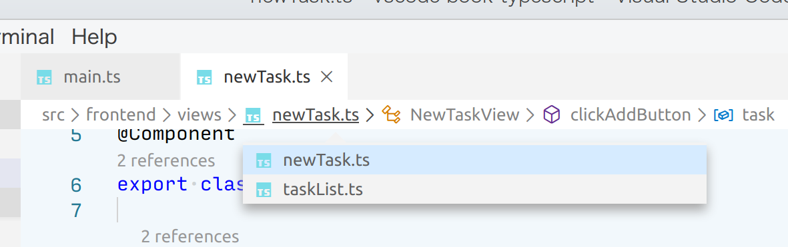
<figcaption>パンくずリスト</figcaption>
</figure>

階層リンクが表示されない場合は以下の設定を追加して下さい。

```
// settings.json
{
  breadcrumbs.enabled": true,
}
```

### 方法 8 : 問題パネル

問題パネルには、リントツールのエラーが表示されます。
多くの拡張機能では現在開いているファイルのエラーが表示されますが、参照しているファイルのエラーも表示することがあります。
その場合、エラーをクリックすることでファイルが開きます。

<figure class="wide">
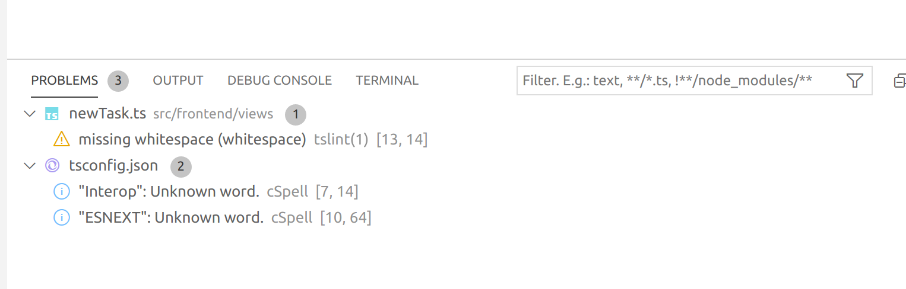
<figcaption>問題パネル</figcaption>
</figure>

## ジャンプした後に戻ってくる

いくつか別のファイルにジャンプする方法を説明しましたが、再び元のファイルに戻ってくるコマンドとして「Go Back」が用意されています。

- 戻る/進む
  - コマンド: Go Back/Forward (workbench.action.navigateBack/navigateForward)
  - ショートカット: Ctrl+-/Ctrl+Shift+-, Alt+Right, Ctrl+Alt+-/Ctrl+Shift+-

筆者は、F12 で定義に飛んだ後に戻ることが多いため、以下のように Shift+F12 にこのコマンドを割り当てています。

```
// keybindings.json
{
  {
    "key": "shift+f12",
    "command": "workbench.action.navigateBack"
  },
}
```

## 対応する括弧にジャンプする

階層構造のあるプログラムを記述する時、対応する括弧にジャンプしたいことがあります。
カーソルの括弧と対応する括弧にジャンプするショートカットがあります。

- 対応する括弧にジャンプする
  - コマンド: Go to Bracket (editor.action.jumpToBracket)
  - ショートカット: Cmd+Shift+\\, Ctrl+Shift+\\, Ctrl+Shift+\

なお、拡張機能「Bracket Pair Colorizer 2」を使うと、対応する括弧が色分けされるため、見やすくなります。

## 選択領域を広げる

構文をみて、選択領域を広げることができます。
例えば、名前空間 → クラス → メソッド →if 文が括弧で入れ子になっている場合、if 文 → メソッド → クラス → 名前空間に選択範囲を広げたり、逆に狭くすることができます。

- 選択範囲を広げる/狭くする
  - コマンド: Expand/Shrink Selection (editor.action.smartSelect.expand/shrink)
  - ショートカット: Ctrl+Shift+→/←, Alt+Shift+→/←, Ctrl+Alt+→/←

## 指定した行番号に移動する

トレースバックなどでは、エラーになった箇所が行番号で表示されることがあります。コマンド「Go to Line...」を使うと、行番号を入力してその行に飛ぶことができます。

- 指定した行に飛ぶ
  - コマンド: Go to Line... (workbench.action.gotoLine)
  - ショートカット: Ctrl+G, Ctrl+G, Ctrl+G

Quick Open からは「:123」と入力すると 123 行目にジャンプします。

## 次のエラーの行に飛び、すぐにクイックフィックスを適用する

リントの結果の修正など、ファイルの中に複数のエラーがある場合、1 つを修正した後に次のエラーに移動したいことがあると思います。
以下のコマンドやキーで次のエラーにジャンプします。

- 次の/前のエラーを表示する
  - コマンド: Go to Next/Previous Problem (editor.action.marker.nextInFiles/prevInFiles）)
  - ショートカット: F8/Shift+F8, F8/Shift+F8, F8/Shift+F8

そのエラーに対してクイックフィックス（コードアクション）がある場合、左側に電球マークが表示されます。

<figure class="wide">
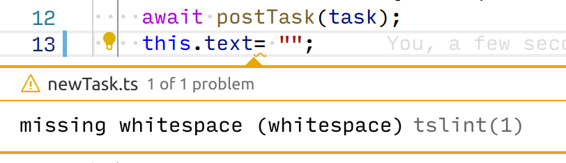
<figcaption>クイックフィックス（コードアクション）</figcaption>
</figure>

このアイコンをクリックするか、キーボードショートカットを押すと、エラーを修正する候補が表示されます。

- クイックフィックス（コードアクション）を適用する
  - コマンド: Quick fix... (editor.action.quickFix)
  - ショートカット: Cmd+., Ctrl+., Ctrl+.

筆者は F8 キーを押して次のエラーに飛ぶことが多いため、クイックフィックスのキーを F8 キーに近い F9 キーに設定しています。

```
// keybindings.json
[
  {
    "key": "f9",
    "command": "editor.action.quickFix",
    "when": "!inDebugMode && editorTextFocus"
  },
]
```

## エディターを分割表示したり、プリセットのレイアウトを使う

エディター内にファイルなどをドラッグするとファイルを開けると前述しましたが、この時エディターの端でドラッグドロップすると、左右上下に分割して表示することができます。タブをドラッグした際も同様です。

<figure class="wide">
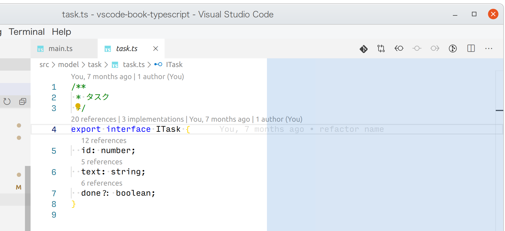
<figcaption>ドラッグでエディター分割</figcaption>
</figure>

また、ウィンドウメニューの View→Editor Layout には、多くのプリセットが用意されています。メニューと同じコマンドも用意されています。

<figure class="wide">
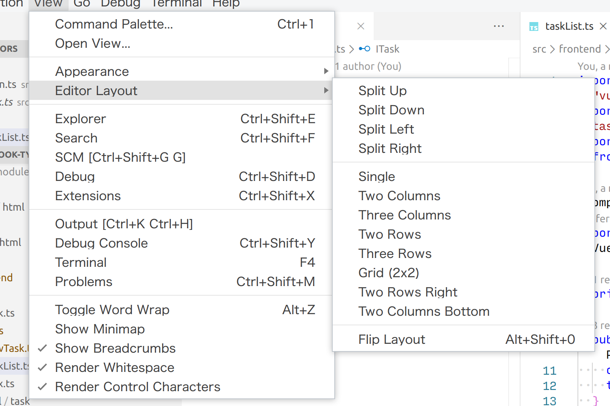
<figcaption>エディターレイアウトのプリセット</figcaption>
</figure>

田の形に 4 分割する 2x2 も用意されています。
逆に、分割を解除するコマンド「View: Single Column Editor Layout」もあります。

## ファイルツリーから特定のファイルを非表示にする

コンパイルされたファイルや、npm の node_modules ディレクトリなど、編集時には表示したくないファイルがあると思います。
設定「files.exclude」を使うと、ファイルツリーに表示したくない除外ファイルを指定することができます。
.git ディレクトリなどは VSCode のデフォルトで表示されないようになっています。

設定は以下のように、ファイルパターンをキーに、値を true と入力します。
逆に、ユーザ設定では除外にするが、このプロジェクトでは表示したいファイルがある場合には、false を設定します。

```
// .vscode/settings.json
{
  "files.exclude": {
    "**/node_modules": true,
  }
}
```

## ファイルコピー時に数値をインクリメントする

VSCode のエクスプローラービュー上でファイルをコピーし、貼り付けを行うと、末尾に copy のついたファイル名になります。
「8.article.md」のようにファイル名に数値がついていた場合、copy を付けずに「9.article.md」と自動でインクリメントしてくれる機能があります。
以下の設定を追加すると有効になります。

```
// settings.json
{
  "explorer.incrementalNaming": "smart",
}
```

## 同じディレクトリのファイルを開く

エディターから:Cmd+Shift+E、/:Ctrl+Shift+E でエクスプローラービューを開くと、エディターで開いていたファイルがファイルツリーで選択された状態になります。
同じディレクトリのファイルが一覧された状態のため、ここからエクスプローラービューでテキストの入力、もしくは矢印キーで選択をして、Enter を押します。
