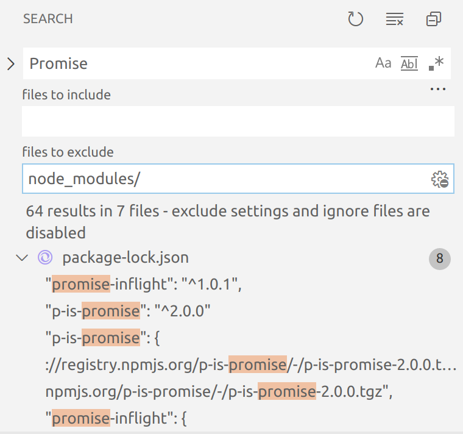

# 検索

## 検索から特定のファイルを除外する

node_modules ディレクトリなどを Search View から除外したい場合があると思います。

検索ビューには、「file to exclude」という除外するファイルパスを指定するエリアがあります。
ここにファイルパスやディレクトリを入力すると、該当するファイルを検索から除外します。

<figure class="wide">

<figcaption>file to exclude</figcaption>
</figure>

「file to exclude」のエリアの右端のアイコンは、除外するファイルパスを設定「search.exclude」から取得します。
ワークスペースの設定にこの設定を追加しておくと、他の開発者と共有できて便利です。

```
// .vscode/settings.json
{
  "search.exclude": {
    "**/node_modules": true,
    "out/js": true,
  }
}
```

## 特定のディレクトリ内で検索する

検索ビューは「file to exclude」にファイルパスを追加すると、そのパスの範囲で検索を行います。
ファイルツリー中のディレクトリの右クリックメニューから「Find in Folder」を選ぶと、そのディレクトリを「file to exclude」に追加して、そのディレクトリを対象に検索を行うことができます。
