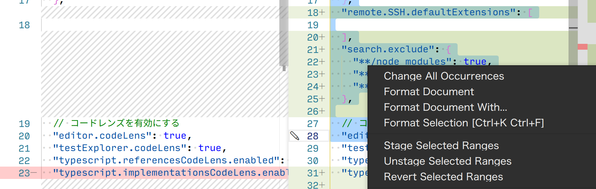
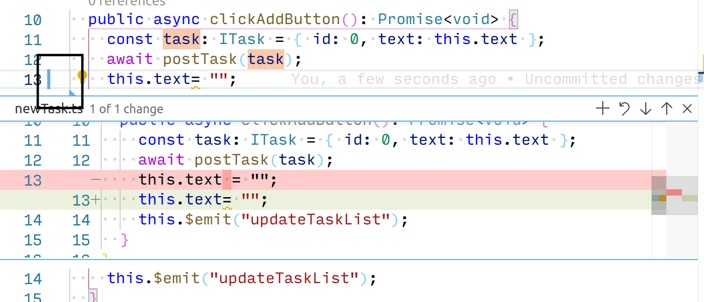

# Git

## 変更を部分的にステージに追加する、またはもとに戻す

Git では行単位で変更をステージングし、コミットすることができます。
VSCode では、ソースコントロールビューでファイルの差分を表示している時に部分的に追加したい行を選択し、右クリックメニューで「Stage Selected Ranges」を選ぶと部分的にステージに追加することができます。
また、変更の取消もここから行うことができます。

<figure class="wide">

<figcaption>選択した行の右クリックメニュー</figcaption>
</figure>

また、ステージングされていない変更がある場合、エディターの行番号とテキストの間にマークが付きます。
これをクリックすると、変更をエディター内で確認することができます。
このウィンドウの右上のボタンで、この範囲をステージに追加する、またはもとに戻すことができます。

<figure class="wide">

<figcaption>マークの位置と、エディター内で開いた変更</figcaption>
</figure>

## 次の変更行に飛ぶ

ステージングされていない変更にジャンプするコマンドがあります。
このコマンドを使うと次の変更にジャンプすることができ、コミット前に変更を効率的に確認することに使えます。

- 次の/前の変更へジャンプ
  - Show Next/Previous Change (editor.action.dirtydiff.next/previous)
  - ショートカット: Alt+F3/Alt+Shift+F3, Alt+F3/Alt+Shift+F3, Alt+F3/Alt+Shift+F3
