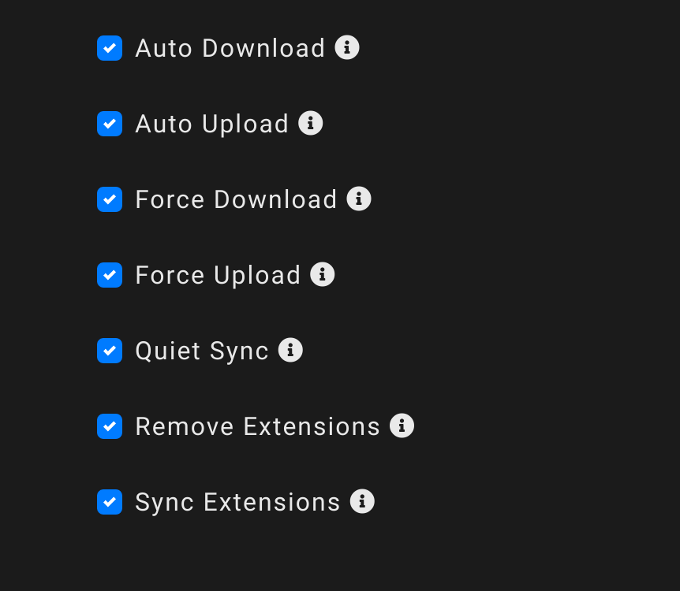

# 環境、設定系

## 異なるマシン間で設定や拡張機能を同期する

複数のマシンで設定やインストールした拡張機能を同期させる拡張機能に「Setting Sync<span class="footnote">https://marketplace.visualstudio.com/items?itemName=Shan.code-settings-sync</span>」があります。

<figure class="wide">

<figcaption>Setting Sync</figcaption>
</figure>

Setting Sync は、gist に設定ファイルをコミットし、その設定ファイルを各マシンで同期させるものです。

gist の設定を済ませた後は、コマンド「Sync: Advanced Options」から、「Sync: Toggle Auto-Upload On Setting Change」と「Sync: Toggle Auto-Download On Startup」を実行すると、自動アップロード、ダウンロードを有効にできます。

また、設定だけではなく拡張機能も同期することができます。
コマンド「Sync: Advanced Options」から「Sync: Open Settings」を選択して設定画面を開き、「Sync Extensions」をクリックして有効化します。

<figure class="wide">

<figcaption>Settings Syncの設定</figcaption>
</figure>

## Setting Sync で設定を同期しつつ、ホストや OS ごとに異なる設定を行う

Setting Sync にはホスト名、OS ごとに設定を使い分ける機能があります。
以下のように`// @sync os=linux`というコメントを付けると、その下の行の設定は特定の OS の場合のみ有効になります。

```
// settings.json
{
  // @sync os=linux
  "python.pythonPath": "/home/linuxbrew/.linuxbrew/bin/python3",
  // @sync os=mac
  // "python.pythonPath": "/usr/local/bin/python3",
  // @sync os=windows
  // "python.pythonPath": "C:\\Users\\nnyn\\AppData\\Local\\Programs\\Python37\\python.exe",
}
```

その環境で有効でない設定はコメントアウトしておきます。
OS によってコメントアウトが切り替えられ、それぞれの環境で有効と無効が切り替わります。

また、同一 OS であるが 2 台以上の PC で異なる設定をしたい場合、ホスト名を設定して設定を切り替えることができます。

コマンド「Sync: Advanced Options」から「Sync: Edit Extension Local Settings」を実行すると、ローカルの Setting Sync の設定ファイルを開くことができます。
この設定に「hostName」という設定があり、これが環境名として使われます。

```
// syncLocalSettings.json
{
  // ...
  "hostName": "home",
}
```

先ほどの OS の分別と同じように、`// @sync host=home`というコメントを設定の前の行に指定します。
OS と環境名の設定を同時に記述することも可能です。

```
// settings.json
{
  "cSpell.dictionaryDefinitions": [
    {
      "name": "my_work",
      // @sync host=work os=mac
      // "path": "/Users/atsushi.morimoto/dotfiles/CodeSpellChecker/work.txt"
      // @sync host=work os=linux
      // "path": "/home/atsushi.morimoto/dotfiles/CodeSpellChecker/work.txt"
      // @sync host=home os=mac
      // "path": "/Users/nnyn/dotfiles/CodeSpellChecker/work.txt"
      // @sync host=home os=linux
      "path": "/home/nnyn/dotfiles/CodeSpellChecker/work.txt"
    },
  ]
}
```
