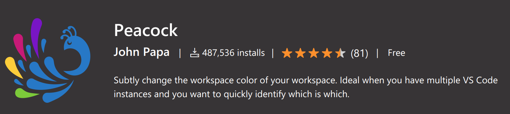

# 見た目系

## 使っているカラーテーマを一部分だけ変更する

マーケットプレースにあるテーマを使っていて、一部の色が見にくいことがあるでしょう。
そのときは設定を使ってテーマに上書き設定をすることができます。

設定には、エディターの色を設定する「editor.tokenColorCustomizations」と、エディター以外のフレームの色を設定する「workbench.colorCustomizations」があります。

例えば「Monokai Pro」のコメントの色を変えたい場合、以下のように設定します。

```
// settings.json
{
  "editor.tokenColorCustomizations": {
    "[Monokai Pro]": {
        "comments": "#B6B6B6"
    }
  },
}
```

## ワークスペースごとに色を変える

複数の VSCode のウィンドウを開いて作業する時、どのワークスペースの VSCode を使っているか迷うことがあるでしょう。
ひと目でどのワークスペースかわかるようにするのは良い方法です。

ワークスペースの設定に、前の項目の設定を行うと色を変えることができます。

おしゃれな色にさっと変えたい場合、拡張機能「Peacock<span class="footnote">https://marketplace.visualstudio.com/items?itemName=johnpapa.vscode-peacock</span>」を使うと便利です。

<figure class="wide">

<figcaption>Peacock</figcaption>
</figure>

コマンド「Peacock: Change to a Favorite Color」を実行すると色が選択でき、ワークスペースの設定にこの色の設定が反映されます。
