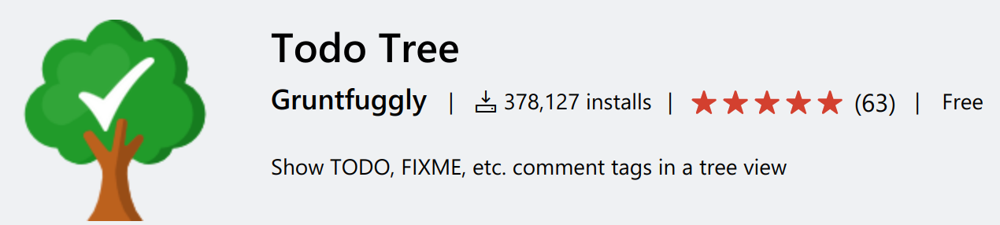
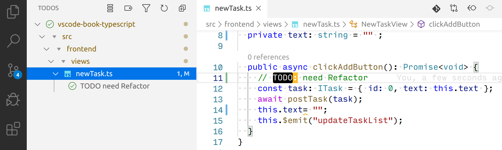
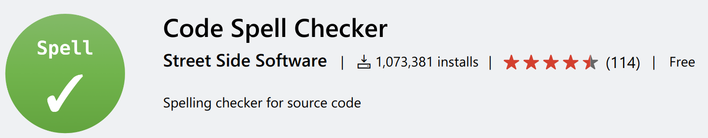

# その他

## TODO コメントを管理する

<figure class="wide">

<figcaption>Todo Tree</figcaption>
</figure>

拡張機能「Todo Tree<span class="footnote">https://marketplace.visualstudio.com/items?itemName=Gruntfuggly.todo-tree</span>」をインストールすると、Todo Tree のタブがアクティビティバーに追加されます。
この Todo Tree ビューでは、ソースコードの`// TODO: hogehoge` とコメント中に`TODO:`とつけると、それを拾ってツリー状の UI で表示します。

また、その部分をハイライトし、見やすくすることもできます。

<figure class="wide">

<figcaption>Todo Treeビュー</figcaption>
</figure>

## スペルミスをチェックする

<figure class="wide">

<figcaption>Code Spell Checker</figcaption>
</figure>

拡張機能「Code Spell Checker<span class="footnote">https://marketplace.visualstudio.com/items?itemName=streetsidesoftware.code-spell-checker</span>」を使うと、一般的な英単語のスペルミスをチェックしてくれます。

また、行区切りの辞書ファイルを作成し、単語を登録することもできます。

```
// settings.json
{
  "cSpell.dictionaryDefinitions": [
    {
      "name": "my_work",
      "path": "/home/nnyn/dotfiles/CodeSpellChecker/work.txt"
    },
  ]
}
```
