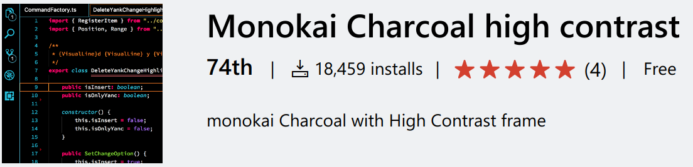

# 筆者が活用している設定

VSCode には多数の設定がありますが、初期状態では有効になっていない、隠れている機能が多々あります。
ここでは筆者が実際に活用している設定を紹介します。
読者のみなさんが使っている設定と比較して、参考にしてもらえればと思います。

## 見た目、カーソル周りの設定

```
// settings.json
{
  // フォントの設定
  // 英語と日本語で別のフォントを設定するため、英語のフォントを先に書く
  "editor.fontFamily": "Liga InputMono,Han Code JP",
  // リガチャを有効にする
  "editor.fontLigatures": true,
  // フォントウェイトと、サイズ
  "editor.fontWeight": "400",
  "editor.fontSize": 14,
  // デバッグコンソールのフォントサイズ
  "debug.console.fontSize": 14,
  // ターミナルのフォントサイズ
  "terminal.integrated.fontSize": 14,

  // ハイコントラストのオリジナルカラーテーマ
  "workbench.colorTheme": "monokai-chacoral(HC)",
  // 有償の Monokai Pro のアイコンが上のテーマに合います
  "workbench.iconTheme": "Monokai Pro Icons",

  // カーソル
  "editor.cursorStyle": "line",
  // カーソルの点滅は複数種類定義があります
  "editor.cursorBlinking": "smooth",
  // カーソルの太さ
  "editor.cursorWidth": 3,
  // カーソルラインの表示を行番号まで囲う表示にする
  "editor.renderLineHighlight": "all",

  // メニューバーをタイトルバーいドッキングしてシンプルにする
  "window.titleBarStyle": "custom",
  // メニューバーは使わないけど、バージョン番号を表示するためだけに有効化している
  "window.menuBarVisibility": "default",
}
```

筆者は「Monokai Charcoal high contrast<span class="footnote">https://marketplace.visualstudio.com/items?itemName=74th.monokai-charcoal-high-contrast</span>」という、Monokai をベースに少し色の変更を加えたカラーテーマを作成して配布しています。
ハイコントラストのウィンドウフレームを使っていることが特徴です。

<figure class="wide">

<figcaption>Monokai Charcoal high contrast</figcaption>
</figure>

## エディター内の表示の設定

```
// settings.json
{
  // 長い行の折返しを有効にする
  "editor.wordWrap": "on",
  // 折返した行はインデントしてわかるようにする
  "editor.wrappingIndent": "indent",

  // 行番号を表示する
  "editor.lineNumbers": "on",
  // 折りたたみは表示しない
  "editor.folding": false,
  // スペース、タブを表示する
  "editor.renderWhitespace": "all",
  // 制御文字を表示する
  "editor.renderControlCharacters": true,
  // ミニマップは表示しない
  "editor.minimap.enabled": false,
  // パンくずリストは表示する
  "breadcrumbs.enabled": true,
  // コードレンズは有効化する
  "editor.codeLens": true,
  // カーソル位置の問題をステータスバーに表示する
  "problems.showCurrentInStatus": true,
}
```
