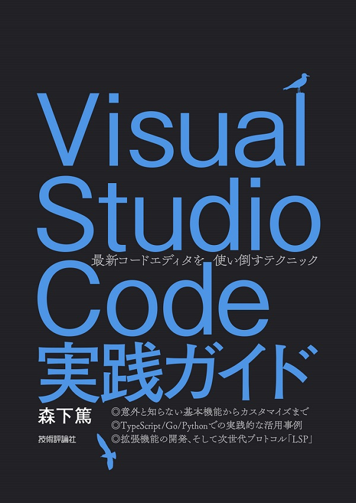
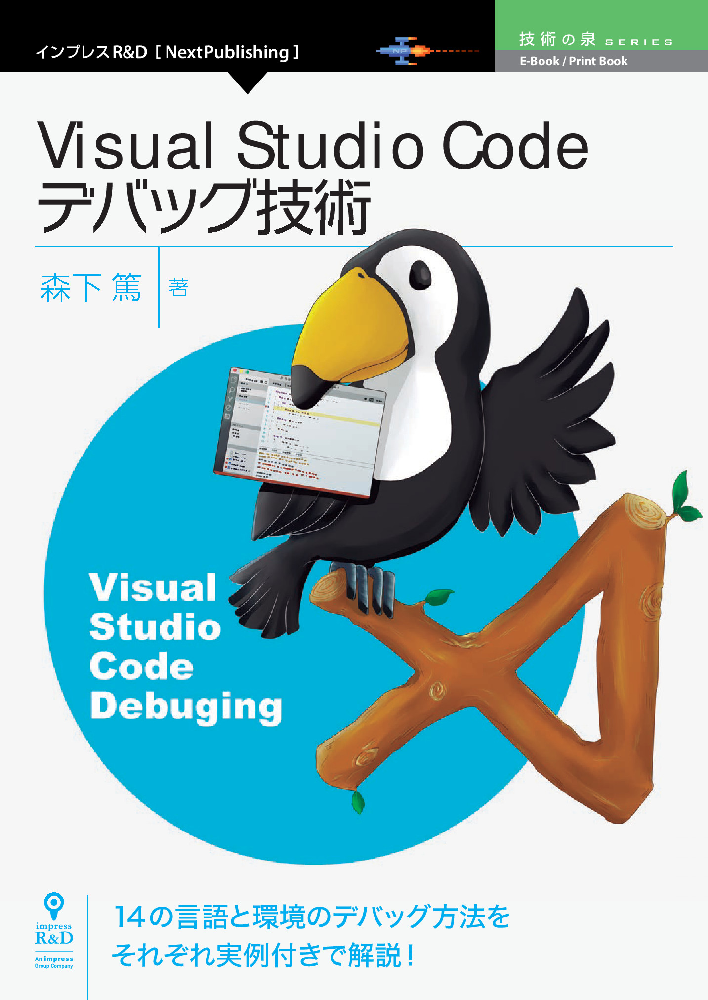

# 著者 VSCode 関連著作紹介

## 商業誌: Visual Studio Code 実践ガイド

<figure>

<figcaption>Visual Studio Code 実践ガイド</figcaption>
</figure>

VSCode の解説書の決定版、『Visual Studio Code 実践ガイド』技術評論社 https://gihyo.jp/book/2020/978-4-297-11201-1を技術評論社より、2020 年 2 月に出版しました！
基本的な VSCode の使い方もさることながら、プロダクトで Go、TypeScript、Python で開発してきたノウハウを詰めました。
さらに拡張機能開発のガイドとして使えるようにし、最後は LSP の解説まで踏み込みます。
以下に目次を掲載します。

- 第 1 部　 Visual Studio Code の基本
  - 第 1 章　インストールと初期設定 —— Visual Studio Code を使いはじめる
  - 第 2 章　画面構成と基本機能 —— 直感的な画面に隠された多くの機能たち
  - 第 3 章　ビューとコマンドパレット —— 多彩な情報を整理し，簡単に呼び出す
  - 第 4 章　 Git との連携 —— 基本操作から便利な拡張機能まで
  - 第 5 章　デバッグ機能 —— さまざまな言語のデバッグを直感的な UI で行う
  - 第 6 章　そのほかの機能 —— タスク，リント，スニペット，ターミナル
  - 第 7 章　リモート開発機能 —— 開発環境と実行環境の差分を抑える新機能
  - 第 8 章　カスタマイズ —— 柔軟な設定項目，ショートカットでより使いやすく
  - 第 9 章　拡張機能 —— 導入，管理，おすすめの拡張機能
- 第 2 部　実際の開発で Visual Studio Code を使う
  - 第 10 章　 TypeScript での開発 —— デフォルトで使えるフロントエンド／Web API アプリ開発機能たち
  - 第 11 章　 Go での開発 —— 各種の開発支援ツールと連携した拡張機能
  - 第 12 章　 Python での開発 —— Web API 開発にも，Jupyter 機械学習にも活用できる
- 第 3 部　拡張機能の開発と Language Server Protocol
  - 第 13 章　拡張機能開発の基本 —— Visual Studio Code の拡張ポリシーとひな形の作成
  - 第 14 章　実践・拡張機能開発
    - テキストを編集する拡張機能の開発
    - スニペットの拡張機能の開発
    - リントの拡張機能開発
    - カラーテーマの拡張機能の開発
    - 新しい UI を提供する拡張機能の開発
  - 第 15 章　自作の拡張機能を公開する —— 広く使ってもらうため必要なさまざまな事項
  - 第 16 章　 Language Server Protocol —— エディター拡張のための次世代プロトコル
    - LSP とは
    - LSP の仕様と Visual Studio Code の動作
    - 言語サーバーとしてリントの拡張機能を作成する

こちらは全国の書店、Amazon などで販売中です。
また、電子版は技術評論社のサイトから購入できます。

なお本同人誌（VSCode Ninja Guide）とこの商業誌は無関係の著作になります。
本同人誌について、技術評論社に問い合わせることはおやめいただき、直接筆者Twitter: @74th, mail: site@74th.techまでお願いします。

## 商業誌: Visual Studio Code デバッグ技術

Visual Studio Code の 14 の言語と環境それぞれでのユニットテストや実行プログラムのデバッグ方法をまとめた『Visual Studio Code デバッグ技術』https://nextpublishing.jp/book/10255.htmlを、インプレス R&amp;D より 2018 年 12 月に出版しました。
もとは技術書典 3 で頒布した本ですが、Ruby などの言語を追加した他、出版時の最新の内容へ更新しました。
書店では注文が必要になりますが、Amazon で紙の書籍https://www.amazon.co.jp/dp/4844398628/と Kindle 版https://www.amazon.co.jp/dp/B07KXGNVS2/を、達人出版会https://tatsu-zine.com/books/vscode-debug-tech、Boothhttps://booth.pm/ja/items/1314180で PDF、ePub 版を販売しています。
よろしければこちらもお手にとっていただければと思います。

<figure>

<figcaption>Visual Studio Codeデバッグ技術</figcaption>
</figure>

またこの本の内容である、本書でも紹介した VSCode のデバッグ設定に関する情報は、オープンソースとして githubhttps://github.com/74th/vscode-debug-specsでも公開しています(英語情報のみ)。

なお本同人誌とこの商業誌は無関係の著作になります。
本同人誌について、インプレス R&amp;D に問い合わせることはおやめいただき、直接筆者までお願いします。

## 同人誌: Visual Studio Code Remote Dev & Cloud Code Guide

<figure class="wide">

<figcaption>Visual Studio Code Remote Dev &amp; Cloud Code Guide</figcaption>
</figure>

リモート開発機能と Cloud Code について書いた同人誌『Visual Studio Code Remote Dev & Cloud Code Guide』https://booth.pm/ja/items/1575583を頒布しています。
なぜリモート開発機能が開発環境を一変させるほど優れているといえるのか、その魅力に迫ります。
また、リモートコンテナ機能の実践例、Cloud Code の使い方についても記載しています。
